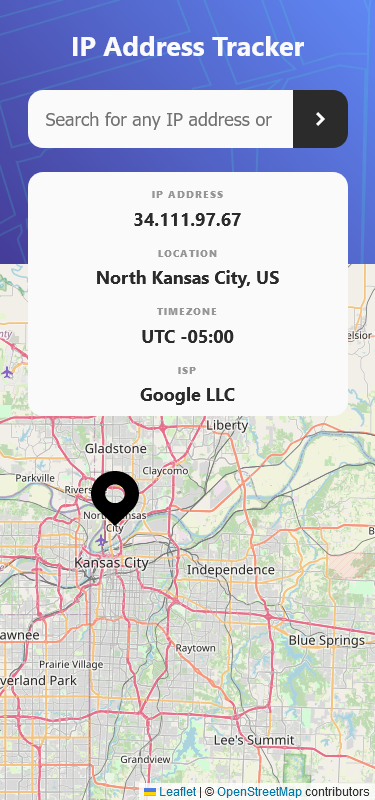
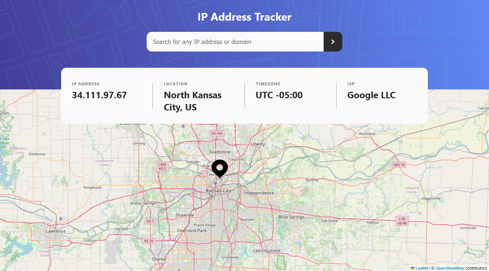

# Frontend Mentor - IP address tracker solution

This is a solution to the [IP address tracker challenge on Frontend Mentor](https://www.frontendmentor.io/challenges/ip-address-tracker-I8-0yYAH0).
This project does not have a Live-Site because I made a mistake and the request limit of the one-time trial from ipifiy is used up, so there wouldn't be a point.

## Table of contents

- [Overview](#overview)
  - [The challenge](#the-challenge)
  - [Screenshot](#screenshot)
- [My process](#my-process)
  - [Built with](#built-with)
  - [What I learned](#what-i-learned)
  - [Useful resources](#useful-resources)
- [Author](#author)
- [Acknowledgments](#acknowledgments)

## Overview

### The challenge

Users should be able to:

- View the optimal layout for each page depending on their device's screen size
- See hover states for all interactive elements on the page
- See their own IP address on the map on the initial page load
- Search for any IP addresses or domains and see the key information and location

### Screenshot

## My process

### Built with

- Semantic HTML5 markup
- CSS custom properties
- Flexbox
- Mobile-first workflow
- [React](https://reactjs.org/) - JS library

### What I learned

- fetching data from API
- How to use ReactLeafletJS

### Useful resources

- [iHateRegex](https://ihateregex.io/expr/ip/) - Even though I don't hate regex, not having to do the regex for IPv4 or IPv6 was very useful.

## Author

- Website - [Paul Pfütze](https://sutontoch.github.io/Portfolio/)
- Frontend Mentor - [@SutonToch](https://www.frontendmentor.io/profile/SutonToch)

## Acknowledgments

- [Harihara Roopan](https://stackoverflow.com/questions/65322670/change-center-position-of-react-leaflet-map) - For some reason I didn't think of this way to recenter the map. Thx!